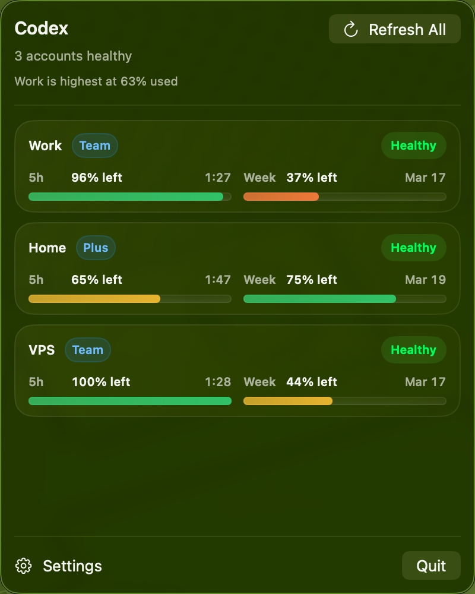
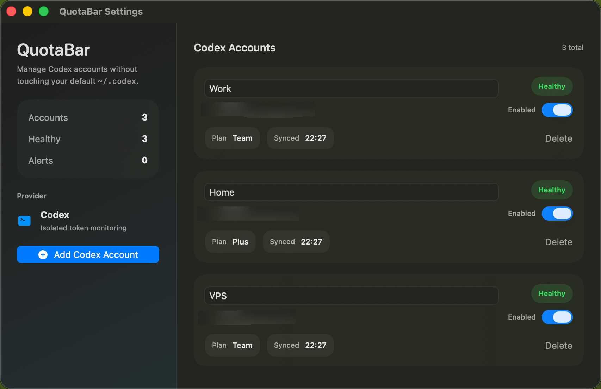

# QuotaBar

QuotaBar is a macOS menu bar app for monitoring Codex usage across multiple isolated accounts.

It is designed for people who want:

* a status bar app instead of a full desktop window
* multiple Codex accounts under one app
* isolated account storage without touching the default `~/.codex`
* quick visibility into the current 5-hour and weekly remaining quota

## Screenshots

### Menu Bar Panel



### Settings



## What It Does

QuotaBar currently supports:

* multiple Codex accounts for a single provider
* browser-based `codex login` in an isolated temporary `CODEX_HOME`
* manual `auth.json` import
* secure auth blob storage in Keychain
* per-account metadata storage in SwiftData
* menu bar monitoring panel
* manual refresh
* background refresh every 30 minutes

The monitoring panel shows:

* account email
* plan tag
* 5-hour remaining quota
* weekly remaining quota
* short reset timestamps
* account health state

## How It Works

QuotaBar does not read or modify the default Codex CLI directory.

Each account is handled like this:

1. Login runs in an app-managed isolated `CODEX_HOME`
2. The resulting `auth.json` is stored in Keychain
3. Non-sensitive account metadata is stored in SwiftData
4. Refresh extracts a bearer token from the stored auth blob
5. Usage is fetched from:

```text
https://chatgpt.com/backend-api/wham/usage
```

QuotaBar maps that response into:

* 5h remaining
* weekly remaining
* reset times
* plan type

## Storage Model

Sensitive data:

* full `auth.json` per account
* stored in macOS Keychain

Non-sensitive data:

* display name
* email
* remote account id
* plan type
* enabled/disabled state
* sync timestamps
* stored in SwiftData

## Requirements

* macOS
* Xcode 16+
* an installed `codex` CLI available to the app

## Run Locally

Open the project in Xcode:

```bash
open QuotaBar.xcodeproj
```

Or build from Terminal:

```bash
xcodebuild \
  -project QuotaBar.xcodeproj \
  -scheme QuotaBar \
  -configuration Debug \
  CODE_SIGNING_ALLOWED=NO \
  CODE_SIGNING_REQUIRED=NO \
  build
```

## Notes

* This is not an official OpenAI product.
* The usage endpoint and auth format are not stable public APIs and may change.
* API-key-only auth is not supported for quota monitoring. A ChatGPT/Codex bearer token is required.

## Privacy

QuotaBar is built to minimize account cross-contamination:

* it does not reuse the default `~/.codex`
* each account is stored independently
* refresh uses the account’s own stored auth blob

## Project Status

Current scope is intentionally narrow:

* one provider: Codex
* one menu bar monitor
* multi-account support first

More providers can be added later behind the same account/service model.

## License

MIT. See [LICENSE](/Users/aidan/dev/app/QuotaBar/LICENSE).
